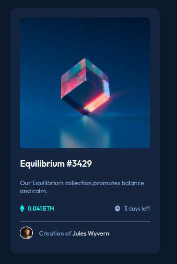

# Frontend Mentor - NFT preview card component solution

This is a solution to the [NFT preview card component challenge on Frontend Mentor](https://www.frontendmentor.io/challenges/nft-preview-card-component-SbdUL_w0U). Frontend Mentor challenges help you improve your coding skills by building realistic projects. 

## Table of contents

- [Overview](#overview)
  - [The challenge](#the-challenge)
  - [Screenshot](#screenshot)
  - [Links](#links)
- [My process](#my-process)
  - [Built with](#built-with)
  - [What I learned](#what-i-learned)
  - [Continued development](#continued-development)
  - [Useful resources](#useful-resources)
- [Author](#author)

## Overview

### The challenge

Users should be able to:

- View the optimal layout depending on their device's screen size
- See hover states for interactive elements

### Screenshot

### Links

- Solution URL: [Add solution URL here](https://github.com/gabrielpb88/frontendmentor/tree/nft-preview-card)
- Live Site URL: [Add live site URL here](gabrielpb88.github.io/frontendmentor/nft-preview-card)

## My process

### Built with

- Semantic HTML5 markup
- CSS variables
- Flexbox
- CSS Position
- Mobile-first workflow

### What I learned

The usage of CSS `position` attribute with `absolute` or `relative` values to position or to display based on states like `active`, `hover` or any other.

### Continued development

I intend to keep practicing the usage of CSS variables, positions and classes naming.

### Useful resources

- [Article](https://www.alura.com.br/artigos/entenda-a-propriedade-position-css) - This helped me with the usage of CSS `position` attribute.

## Author

- Frontend Mentor - [@gabrielpb88](https://www.frontendmentor.io/profile/gabrielpb88)