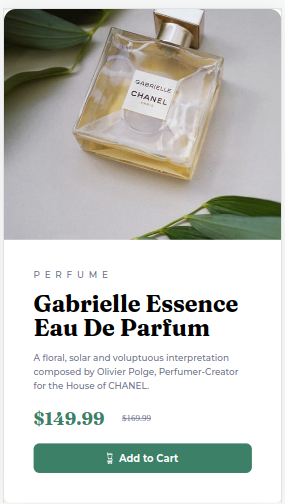

# Frontend Mentor - Product preview card component solution

This is a solution to the [Product preview card component challenge on Frontend Mentor](https://www.frontendmentor.io/challenges/product-preview-card-component-GO7UmttRfa). Frontend Mentor challenges help you improve your coding skills by building realistic projects. 

## Table of contents

- [Overview](#overview)
  - [The challenge](#the-challenge)
  - [Screenshot](#screenshot)
  - [Links](#links)
- [My process](#my-process)
  - [Built with](#built-with)
  - [What I learned](#what-i-learned)
  - [Continued development](#continued-development)
- [Author](#author)

## Overview

### The challenge

Users should be able to:

- View the optimal layout depending on their device's screen size
- See hover and focus states for interactive elements

### Screenshot

#### Desktop


#### Mobile


### Links

- Solution URL: [Repository](https://github.com/gabrielpb88/frontendmentor/tree/product-preview-card)
- Live Site URL: [Live URL](https://gabrielpb88.github.io/frontendmentor/product-preview-card-component-main)

## My process

### Time
- Estimated: 4 hours
- Taken: 6 hours

### Built with

- Semantic HTML5 markup
- CSS custom properties
- Flexbox
- Responsive

### What I learned

- Media queries to implement the responsive behavior.
- I used an ```img``` tag at the beginning but don't know why I changed to use a ```div``` with background (Not a good idea)
- Because I used a background image in a div I had to take of attributes like no-repeat, position, etc

### Continued development

I want to continue focusing in responsive layouts, flexbox and more other approaches for the solutions.

## Author

- Frontend Mentor - [@gabrielpb88](https://www.frontendmentor.io/profile/gabrielpb88)