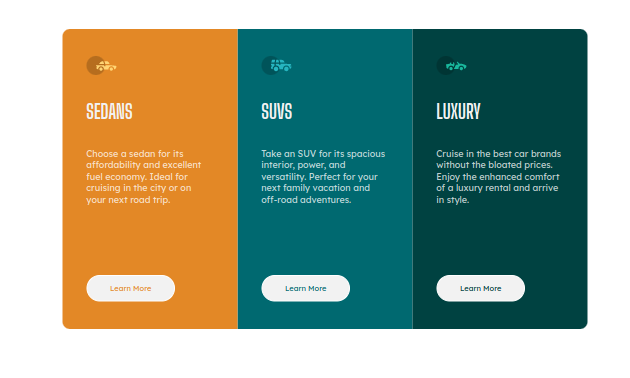
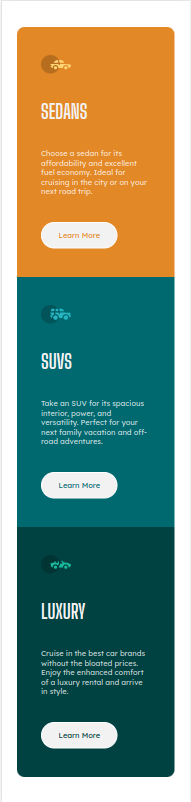

# Frontend Mentor - 3-column preview card component solution

This is a solution to the [3-column preview card component challenge on Frontend Mentor](https://www.frontendmentor.io/challenges/3column-preview-card-component-pH92eAR2-). Frontend Mentor challenges help you improve your coding skills by building realistic projects. 

## Table of contents

- [Overview](#overview)
  - [The challenge](#the-challenge)
  - [Screenshot](#screenshot)
  - [Links](#links)
- [My process](#my-process)
  - [Built with](#built-with)
  - [What I learned](#what-i-learned)
  - [Continued development](#continued-development)
- [Author](#author)

**Note: Delete this note and update the table of contents based on what sections you keep.**

## Overview

### The challenge

Users should be able to:

- View the optimal layout depending on their device's screen size
- See hover and focus states for interactive elements

### Screenshot

#### Desktop

#### Mobile

### Links

- Solution URL: [Repository](https://github.com/gabrielpb88/frontendmentor/tree/three-column-preview-card)
- Live Site URL: [Live URL](https://gabrielpb88.github.io/frontendmentor/three-column-preview-card)

## My process

### Built with

- Semantic HTML5 markup
- Mobile First 
- React
- Styled-components
- CSS Grid

### What I learned

- It was a good opportunity to practice using style-components and mobile-first.
- I learned that react-app-env.d.ts file is the responsible to enable import of svg files using create-react-app and react-scripts. 
- GlobalStyles to reset the css.

### Continued development

Now, take more complex layouts to use style-components and practice Components with react.

## Author

- Frontend Mentor - [@gabrielpb88](https://www.frontendmentor.io/profile/gabrielpb88)