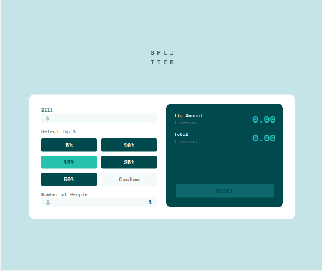
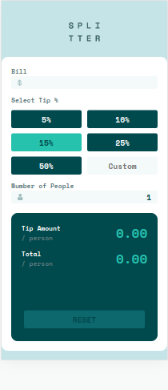

# Frontend Mentor - Tip calculator app solution

This is a solution to the [Tip calculator app challenge on Frontend Mentor](https://www.frontendmentor.io/challenges/tip-calculator-app-ugJNGbJUX). Frontend Mentor challenges help you improve your coding skills by building realistic projects.

## Table of contents

- [Overview](#overview)
  - [The challenge](#the-challenge)
  - [Screenshot](#screenshot)
  - [Links](#links)
- [My process](#my-process)
  - [Built with](#built-with)
  - [What I learned](#what-i-learned)
  - [Continued development](#continued-development)
- [Author](#author)

## Overview

### The challenge

Users should be able to:

- View the optimal layout for the app depending on their device's screen size
- See hover states for all interactive elements on the page
- Calculate the correct tip and total cost of the bill per person

### Screenshot

#### Desktop

#### Mobile

### Links

- Solution URL: [Repository](https://github.com/gabrielpb88/frontendmentor/tree/tip-calculator)
- Live Site URL: [Live Url](https://gabrielpb88.github.io/frontendmentor/tip-calculator)

## My process

### Built with

- Semantic HTML5 markup
- CSS custom properties
- SCSS
- Mobile-first workflow
- Vanilla Javascript

### What I learned

First time using SCSS. I think it is very usefull by allowing to write SCSS almost like json objects.
Validation without any lib is very boring and it is easy to make mistakes.

### Continued development

Probably I am going to start using some lib or frontend framework as react or angular to build components and use validation libraries to validate fields.

## Author

- Frontend Mentor - [@gabrielpb88](https://www.frontendmentor.io/profile/gabrielpb88)